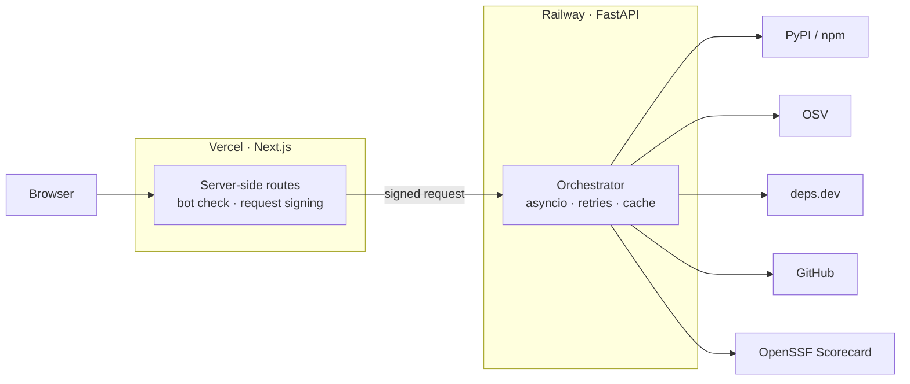

# PackagePulse

Live health checks for your PyPI and npm dependencies.

**Try it:** <https://packagepulse.satharasinghe.com>

Look up a package, or paste a `requirements.txt` or `package.json`. PackagePulse checks the package
registry, OSV, deps.dev, GitHub and OpenSSF Scorecard at the same time, then scores each dependency and
shows the reason behind every point it takes off.

## Features

- **Package report.** Known vulnerabilities, release activity, repository status and supply-chain checks,
  shown as each source answers.
- **Dependency graph.** What a package pulls in, with the health of each direct dependency.
- **Manifest scan.** Every dependency in a project checked at once, placed on a risk map and ranked by what
  to fix first.

## How it works



The web app is a Next.js site on Vercel. The browser only talks to it, and its server-side routes check and
sign each request before calling the API, so the API is never exposed directly.

The API is a FastAPI service on Railway. It uses asyncio to query every source concurrently, with timeouts,
retries, caching and rate limits, and streams results back as they arrive. Scanning a seven-package
manifest takes about one second, against eight if the same calls ran one after another.

## Tech stack

- **API:** Python 3.13, FastAPI, asyncio, httpx, Pydantic
- **Web:** Next.js, React, TypeScript, Tailwind CSS, React Flow
- **Hosting:** Railway and Vercel

## Running locally

The API needs Python 3.13 and [uv](https://docs.astral.sh/uv/):

```sh
cd api
uv sync
uv run uvicorn packagepulse.main:app --reload
```

The web app needs Node 24:

```sh
cd web
npm install
cp .env.example .env.local
npm run dev
```

Then open <http://localhost:3000>. The available settings are listed in `api/.env.example` and
`web/.env.example`.

## Tests

```sh
cd api && uv run pytest
cd web && npm run check
```

## Contributing

Issues and pull requests are welcome.

## Licence

Apache 2.0. See [LICENSE](LICENSE).
