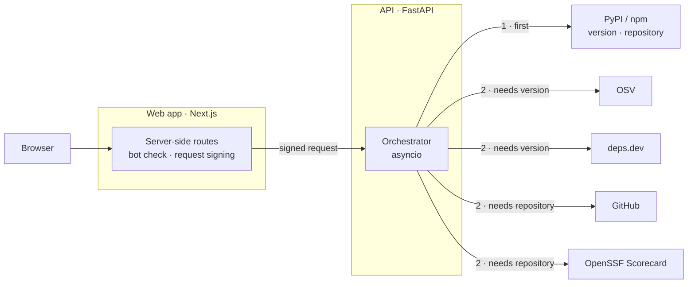

# PackagePulse

**PackagePulse checks the health of PyPI and npm dependencies using live evidence from several independent
sources.** Built with FastAPI and asyncio to query registry, vulnerability, dependency-graph, GitHub and
supply-chain APIs concurrently, while tolerating partial failures.

**[Live demo](https://packagepulse.satharasinghe.com) · [How it works](#how-it-works) · [Design decisions](#design-decisions) · [Run locally](#running-locally)**

Look up a package, or paste a `requirements.txt` or `package.json`. PackagePulse gathers evidence from the
package registry, OSV, deps.dev, GitHub and OpenSSF Scorecard, then scores each dependency and shows the
reason behind every point it takes off.

## Features

- **Package report.** Known vulnerabilities, release activity, repository status and supply-chain checks,
  shown as each source answers.
- **Dependency graph.** What a package pulls in, with the health of each direct dependency.
- **Manifest scan.** Every dependency in a project checked at once, placed on a risk map and ranked by what
  to fix first.

## How it works



The browser only talks to the web app. Its server-side routes check and sign each request before calling
the API, so the API is never exposed directly.

The registry answers first with the version and repository. Every other source starts the moment the data it
needs is known, and results stream back as each one finishes.

| Example `package.json` scan, 7 packages | Time |
| --- | --- |
| Concurrent | 1.0 s |
| Sequential equivalent | 8.3 s |

Measured locally with a cold cache against the live upstream APIs. The sequential figure is the sum of each
upstream call's own duration in the same run.

## Design decisions

| Decision | Why | Trade-off |
| --- | --- | --- |
| **Schedule sources by what they need.** Each declares its inputs; the registry runs first and the rest start as soon as the version or repository is known. | No source waits longer than its inputs, and progress can be shown as it happens. | A small custom scheduler instead of one `asyncio.gather`. A single report is still bounded by the registry, so it gains about 2×, while scans gain about 8×. |
| **Stream results in completion order** over server-sent events. | The page fills in as evidence arrives instead of waiting for the slowest API. | Long-lived connections need heartbeats, a per-visitor stream limit and cleanup when the browser disconnects. A plain JSON endpoint remains for simple clients. |
| **Return partial results instead of errors.** Every source reports ok, not found, failed, timed out or skipped. | One slow or failing API shouldn't hide the evidence from the others. | A score can rest on incomplete evidence, so reports show how much of it was available and fall back to "unknown" below half. |
| **Cap concurrency and set deadlines** per scan, per upstream API and per report. | Keeps the server and the upstream APIs' rate limits safe, even for a 100-package manifest. | Large manifests take longer, and a source slower than the deadline is cut off and marked as timed out. |
| **Cache in memory, with single-flight** for identical calls already in progress. | No extra infrastructure, and repeat lookups return in milliseconds. | One instance only, and the cache resets on restart. It sits behind an interface so a shared store can replace it. |
| **Rule-based scoring** with the reason and source for every point. | Scores are explainable, reproducible and straightforward to test. | Thresholds such as "no release for 18 months" are judgement calls; a finished, stable package can score lower than it deserves. |
| **Keep the API behind the web app**, which signs every request. | The API can't be called directly, secrets never reach the browser, and rate limits apply per real visitor. | An extra hop on every request, and signature checks that depend on accurate clocks and a secret rotation process. |

## Tech stack

- **API:** Python 3.13, FastAPI, asyncio, httpx, Pydantic
- **Web:** Next.js, React, TypeScript, Tailwind CSS, React Flow

## Running locally

The API needs Python 3.13 and [uv](https://docs.astral.sh/uv/):

```sh
cd api
uv sync
uv run uvicorn packagepulse.main:app --reload
```

The web app needs Node 24:

```sh
cd web
npm install
cp .env.example .env.local
npm run dev
```

Then open <http://localhost:3000>. The available settings are listed in `api/.env.example` and
`web/.env.example`.

## Tests

```sh
cd api && uv run pytest
cd web && npm run check
```

## Contributing

Issues and pull requests are welcome.

## Licence

Apache 2.0. See [LICENSE](LICENSE).
