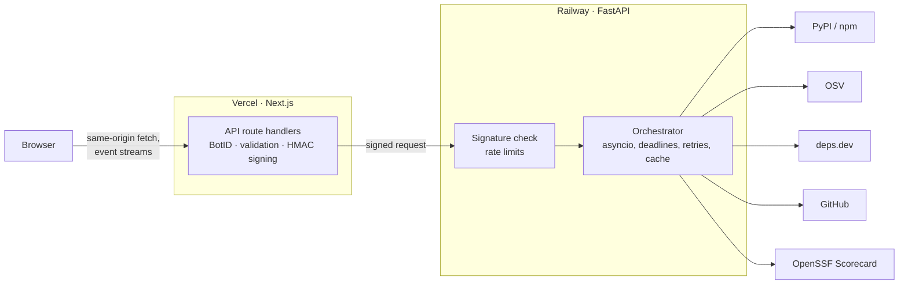

# PackagePulse

Live health evidence for your PyPI and npm dependencies.

Look up a package, or paste a `requirements.txt` or `package.json`, and PackagePulse checks the package
registry, OSV, deps.dev, GitHub and OpenSSF Scorecard at the same time. You get the facts behind each
dependency (known vulnerabilities, how long since the last release, whether the repository is archived)
and a score that explains every point it takes off.

**Try it:** <https://packagepulse.satharasinghe.com>

## Why

Adding a dependency is a decision you live with for years, but the signals that matter are spread across
five different places. A package can look fine on its registry page while its repository was archived two
years ago, or its latest release still carries a known vulnerability.

PackagePulse puts that evidence in one place, fetched live, so the decision is quick and the reasons are
visible.

| Page | What it answers |
| --- | --- |
| Package report | Is this package healthy? Every source is drawn as it answers, then a score with its reasons |
| Dependency graph | What does it pull in, and how healthy are its direct dependencies? |
| Manifest scan | Across my whole project, what should I fix first? |

## Running it

The API needs Python 3.13 and [uv](https://docs.astral.sh/uv/). The web app needs Node 24 (`web/.nvmrc`).

```sh
# terminal 1: the API on http://127.0.0.1:8000
cd api
uv sync
uv run uvicorn packagepulse.main:app --reload
```

```sh
# terminal 2: the web app on http://localhost:3000
cd web
npm install
cp .env.example .env.local
npm run dev
```

Locally the API accepts unsigned requests, so you can also call it directly:

```sh
curl -N localhost:8000/v1/packages/npm/express/stream
curl -N -X POST localhost:8000/v1/scans -H 'content-type: application/json' \
  -d '{"manifest": "requests==2.19.0\nleft-pad\nfastapi\n"}'
```

GitHub allows 60 unauthenticated requests an hour. Set `PP_GITHUB_TOKEN` (a fine-grained token with
read-only access to public repositories) in `api/.env` to get 5,000.

## How it works



The browser only ever talks to the web app. Its route handlers check the request, sign it and stream the
API's response straight back, so the API address and the signing secret never reach the browser.

The API runs the providers as a small dependency graph. The registry answers first with the version and
repository; OSV and deps.dev start as soon as the version is known, GitHub and Scorecard as soon as the
repository is. Each provider has its own concurrency limit, a timeout per attempt inside an overall budget,
retries with jittered backoff that respect `Retry-After`, and a circuit breaker. Responses are cached with a
TTL, identical in-flight requests share one upstream call, and GitHub lookups revalidate with ETags. When a
deadline passes, the report is built from whatever has arrived and the missing sources are marked.

Scores are four dimensions, each starting from 100 and losing points for evidence it can point to:

| Dimension | Weight | Loses points for |
| --- | --- | --- |
| Security | 35% | Known vulnerabilities, a low OpenSSF Scorecard |
| Maintenance | 30% | Deprecation, an archived repository, no release or push for a long time |
| Supply chain | 20% | No or broken repository link, failing Scorecard checks such as dangerous workflows |
| Community | 15% | Built up from GitHub stars and the number of dependent packages |

A deprecated or archived package is capped at 30 and a vulnerable one at 60, so a popular package can't
average its way out of a real problem.

```
api/src/packagepulse/
  main.py              app factory, middleware and routers
  orchestrator.py      runs providers as a dependency graph with a deadline
  registries/          PyPI and npm
  providers/           OSV, deps.dev, GitHub, Scorecard and the shared upstream client
  cache.py             TTL cache and single-flight
  scoring.py           dimensions, caps, flags and the reason behind each point
  routes.py            package report and its event stream
  scans.py             manifest scans and the fix-first ranking
  graph.py             dependency graph with health for direct dependencies
  security/            request signing and rate limits
api/tests/             tests against responses recorded from the real APIs

web/src/
  app/                 pages, and the proxy route handlers under app/api
  components/          waterfall, score ring, health breakdown, graph, risk map, scan views
  lib/upstream/        signing and forwarding to the API
  lib/sse/             event stream reader
  lib/package, graph, scan/   reducers, graph layout and risk map maths
```

### API

| Endpoint | Returns |
| --- | --- |
| `GET /health` | `{"status": "ok"}` |
| `GET /v1/packages/{pypi\|npm}/{name}?version=` | The report as JSON |
| `GET /v1/packages/{ecosystem}/{name}/stream` | Server-sent events: each source as it finishes, then the report |
| `GET /v1/packages/{ecosystem}/{name}/graph` | Server-sent events: the dependency graph, then health for up to 25 direct dependencies |
| `POST /v1/scans` with `{"manifest": "..."}` | Server-sent events: every package, then a summary with the fix-first list |

Errors are [RFC 9457](https://www.rfc-editor.org/rfc/rfc9457) `application/problem+json` with a `code` you
can switch on. Interactive docs are at `/docs` when running locally.

## Security model

The API is public on the internet, so it doesn't trust anything that isn't signed by the web app.

- **Signed requests.** The web app signs every call with HMAC-SHA256 over the timestamp, a nonce, the
  method, path, sorted query, the visitor's IP and a hash of the body. The API rejects timestamps more than
  60 seconds off, nonces it has seen in the last two minutes, and anything that doesn't match. It accepts a
  previous secret as well, so the secret can be rotated without downtime.
  `api/tests/fixtures/signature_vectors.json` holds shared test cases that both implementations must pass.
- **Rate limits** use the IP from the signed request, so they can't be dodged with a spoofed header: 30
  package or graph requests a minute and 4 scans every 10 minutes per visitor, 2 open streams each, and 6
  scans running at once overall.
- **Bot protection.** Vercel BotID is checked on every proxy route. A firewall rate limit on `/api/*` (see
  [Deploying](#deploying)) adds a cap that applies before a function even runs.
- **Nothing leaks back.** The proxy passes on only the content type, cache control and retry hint, never
  the API's own headers. The API's docs and OpenAPI schema are switched off in production, and it refuses
  to start there without a signing secret.
- **Bounded work.** Manifests are capped at 64 KB and 100 packages, graphs at 200 nodes, and every report,
  graph and scan has a deadline.

These are the checks run against the deployed API (`$API_URL`) and site:

| Request | Response |
| --- | --- |
| `curl $API_URL/health` | `200 {"status":"ok"}` |
| `curl $API_URL/v1/packages/pypi/fastapi` | `401 missing_signature` |
| A signature with a 10-minute-old timestamp | `401 stale_signature` |
| A made-up signature | `401 bad_signature` |
| A 300 KB request body | `413 request_too_large` |
| `curl $API_URL/docs` | `401`, docs are off in production |
| `curl https://packagepulse.satharasinghe.com/api/packages/npm/express/stream` | `403 bot_detected` |
| The site's JavaScript bundles searched for the API address or secret names | No matches |

## How fast it is

Concurrency is the point, so here is what it buys. Measured on a laptop with a cold cache. "One by one" is
the sum of every upstream call's own duration, which is what the same work costs sequentially.

| Request | At once | One by one |
| --- | --- | --- |
| `fastapi` report, 6 sources | 0.8 s | 1.3 s |
| Example `package.json` scan, 7 packages | 1.0 s | 8.3 s (8.2×) |
| The same scan again, all 42 calls from cache | 9 ms | |
| `express` dependency graph, 71 packages with 25 direct dependencies scored | 2.8 s | |

A single report gains less than a scan because the registry has to answer before anything else can start.
The gain grows with the number of packages, which is why scans and the graph are where asyncio earns its
place.

## Checks

```sh
cd api && uv run ruff format --check . && uv run ruff check . && uv run mypy src tests && uv run pytest
cd web && npm run check && npm run build
```

CI runs both on every pull request. Upstream APIs are never called in tests: the API tests use responses
recorded from the real services, and the web tests replay event streams recorded from the API.

## Deploying

The API runs on [Railway](https://railway.com) and the web app on [Vercel](https://vercel.com), both
deployed from this repository.

**Railway**

| Setting | Value |
| --- | --- |
| Root Directory | `/api` |
| Railway Config File | `/api/railway.toml` (it doesn't follow the root directory, so give the full path) |
| Variables | `PP_ENV=production`, `PORT=8080`, `PP_SIGNING_SECRET`, `PP_GITHUB_TOKEN` |

The rate limits and cache live in memory, so keep it to one replica.

**Vercel**

| Setting | Value |
| --- | --- |
| Root Directory | `web` |
| Environment variables | `PP_API_URL` (the Railway URL, no trailing slash), `PP_SIGNING_SECRET` (the same value as the API) |
| Function Region | Close to the API, for example London or Frankfurt for an EU Railway region |
| Firewall | Rate limit `/api/*`, for example 40 requests a minute per IP |

Generate the signing secret with `openssl rand -hex 32`. To rotate it, set the new value as
`PP_SIGNING_SECRET` and the old one as `PP_SIGNING_SECRET_PREVIOUS` on the API, update the web app, then
remove the old value.

## Contributing

Issues and pull requests are welcome. New providers implement the `Provider` protocol in
`api/src/packagepulse/domain.py`; another ecosystem only needs a registry adapter, because OSV and deps.dev
already cover Go, Maven, Cargo, NuGet and RubyGems. Please add a recorded fixture rather than calling the
real API in tests, and keep `ruff`, `mypy` and `npm run check` passing.

## Licence

Apache 2.0. See [LICENSE](LICENSE).
